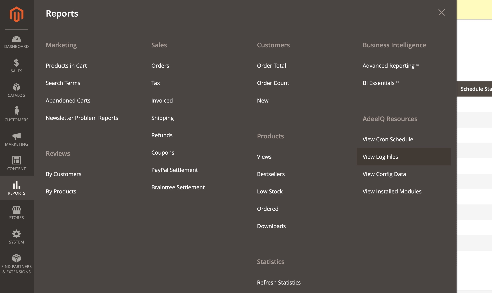
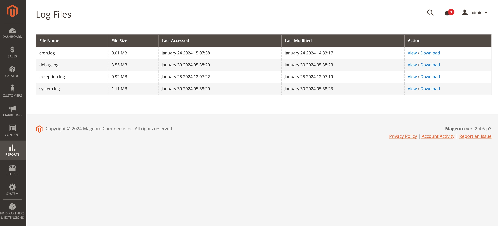
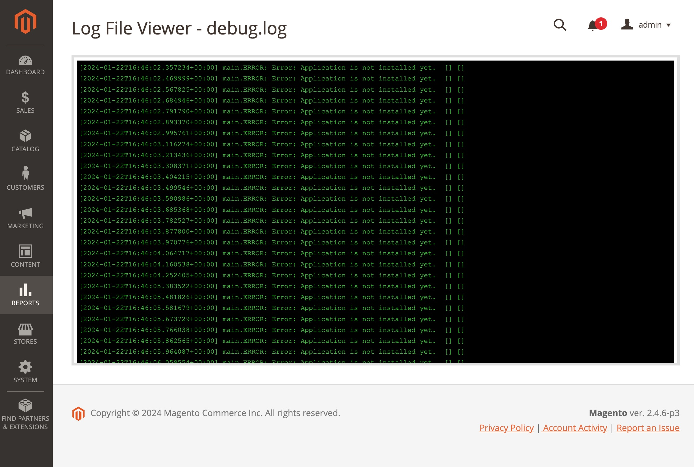

Magento 2 - Logs Viewer & Downloader
 ======
 
[](../CoreConfigDataViewer/LICENSE)

A module that shows list of all log files from var/log folder. User can view the logs file in the viewer as well as download it.

## Requirements

- Magento 2.3+
- Adeelq core module

## Installation

It is recommended to use [composer](https://getcomposer.org) to install the module.

```bash
$ composer require adeelq/magento2-log-viewer-downloader
```
If you do not use composer, ensure that you also load any dependencies that this module has.

## Screenshots
### Menu


### Logs files page


### Logs file viewer

